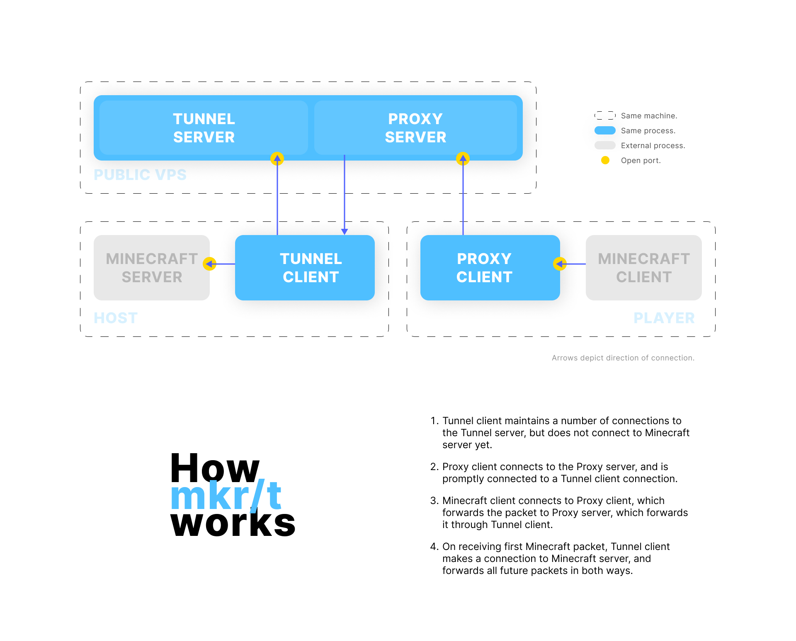

# mkr/t

mkr/t is a secure TCP tunnel, similar to SSH tunnels. However, it's designed for use with mkr/craft Minecraft servers.



## Installation

You'll need to [install Deno](https://deno.land/#installation). If you already have Deno, you might want to upgrade to latest (1.18.1 as of writing) using `deno upgrade`.

Then, simply run the following command:

```shell
deno install --allow-net -rf -n mkrt https://raw.githubusercontent.com/MKRhere/craft/master/lib/tunnel/src/cli.ts
```

If you have a fork, you may replace the installation path with a local path or your own hosted path.

## Usage

```shell
# Run the proxy (as a player)
mkrt proxy --pwd <password> --server craft.mkr.pw:25010 --port 25565

# Running the server (on the public server)
mkrt server --proxy 25010 --proxy-pwd <password> --tunnel 25252 --tunnel-pwd <password> --max-conn 20

# Run the tunnel (from Minecraft host)
mkrt tunnel --pwd <password> --server craft.mkr.pw:25252 --port 25565
```
